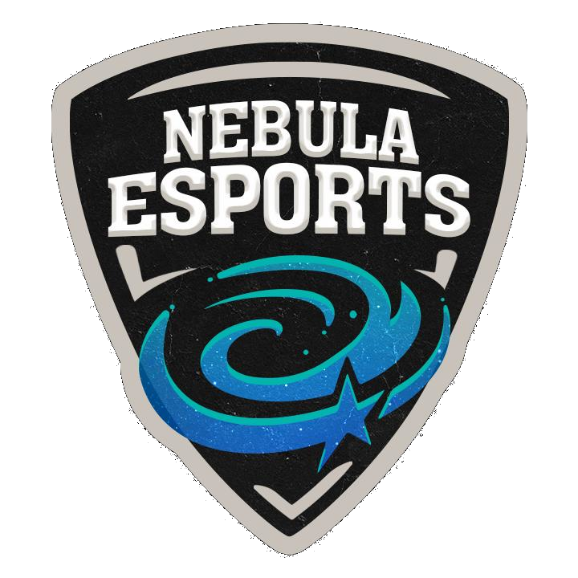

# Nebula Esports 2025 Tournament Platform




A comprehensive web platform for managing esports tournaments, team registrations, and competitive gaming events. Built with PHP, MySQL, and modern web technologies.

## 🎮 Project Overview

Nebula Esports 2025 is a full-featured tournament management system designed for esports competitions. The platform enables teams to register, manage their profiles, and participate in gaming tournaments with proper administrative oversight and role-based access control.

## ✨ Key Features

### 🏆 Tournament Management
- **Tournament Registration**: Teams can register for various gaming competitions
- **Game Support**: Multiple game titles including PUBG Mobile, Free Fire, Call of Duty PC, and PUBG PC
- **Team Management**: Complete team profile management with member details
- **Tournament Rules**: Integrated rules and guidelines system

### 👥 User Management System
- **Multi-Role Authentication**: Support for Users, Organizers, Admins, and Head Admins
- **Secure Login/Registration**: Password hashing, session management, and "Remember Me" functionality
- **Profile Management**: Comprehensive user profiles with team information
- **Password Recovery**: Email-based password reset system

### 🛡️ Administrative Features
- **Role-Based Dashboard**: Different dashboards for each user role
- **User Management**: Create, edit, and manage user accounts
- **Team Oversight**: View and manage team registrations
- **Contact Management**: Handle contact form submissions
- **Newsletter System**: Manage newsletter subscriptions

### 📧 Communication Features
- **Contact Form**: Integrated contact system with message management
- **Newsletter Subscription**: User newsletter signup with admin export capabilities
- **Email Notifications**: Automated email systems for various events

## 🏗️ Technical Architecture

### Backend Technologies
- **PHP 7.4+**: Core backend language with modern features
- **MySQL 5.7+**: Relational database with UTF-8 support
- **PDO**: Secure database abstraction layer
- **Session Management**: Secure user authentication and authorization

### Frontend Technologies
- **HTML5**: Modern semantic markup
- **CSS3**: Custom styling with CSS variables and modern layout techniques
- **JavaScript (ES6+)**: Interactive functionality and form handling
- **Responsive Design**: Mobile-first approach with flexible layouts

### Security Features
- **CSRF Protection**: Cross-site request forgery prevention
- **Password Hashing**: Secure bcrypt password hashing
- **SQL Injection Prevention**: Prepared statements and parameterized queries
- **Input Validation**: Server-side and client-side validation
- **Role-Based Access Control**: Hierarchical permission system

## 📁 Project Structure

```
DIT/
├── assets/                 # Static assets
│   ├── css/               # Stylesheets
│   ├── images/            # Images and logos
│   ├── js/               # JavaScript files
│   └── pdfs/             # Documentation files
├── includes/              # Core PHP includes
│   ├── bootstrap.php     # Application bootstrap
│   ├── config.php        # Database configuration
│   ├── db.php           # Database connection and setup
│   └── functions.php     # Utility functions
├── pages/                # Static HTML pages
├── php/                  # PHP application files
│   ├── signup-login.php  # Authentication
│   ├── user.php         # User profile management
│   ├── dashboard-*.php   # Role-based dashboards
│   ├── contact.php      # Contact form
│   └── *.php            # Other PHP pages
├── sql/                  # Database schema
├── uploads/              # User uploaded files
│   └── team_logos/      # Team logo uploads
└── index.php            # Main landing page
```

## 🚀 Installation & Setup

### Prerequisites
- **Web Server**: Apache/Nginx with PHP support
- **PHP**: Version 7.4 or higher
- **MySQL**: Version 5.7 or higher
- **Extensions**: PDO, PDO_MySQL, GD (for image handling)

### Database Setup

1. **Create Database**:
   ```sql
   CREATE DATABASE nebula DEFAULT CHARACTER SET utf8mb4 COLLATE utf8mb4_unicode_ci;
   ```

2. **Import Schema**:
   ```bash
   mysql -u username -p nebula < sql/schema.sql
   ```

3. **Set Environment Variables**:
   ```bash
   export DB_HOST="127.0.0.1"
   export DB_PORT="3306"
   export DB_NAME="nebula"
   export DB_USER="your_username"
   export DB_PASS="your_password"
   ```

### Web Server Configuration

1. **Document Root**: Point to the project directory
2. **PHP Configuration**:
   - `upload_max_filesize = 10M`
   - `post_max_size = 10M`
   - `session.cookie_httponly = 1`
   - `session.cookie_secure = 1` (for HTTPS)

3. **Directory Permissions**:
   ```bash
   chmod 755 uploads/
   chmod 755 uploads/team_logos/
   ```

### Application Configuration

1. **Environment Setup**: Configure database credentials via environment variables (never hardcode in config.php)
2. **File Uploads**: Ensure the `uploads/team_logos/` directory is writable
3. **HTTPS**: Enable HTTPS for production environments
4. **Error Reporting**: Disable in production, enable for development

## 👤 User Roles & Permissions

### 🎯 User Hierarchy
1. **User**: Basic tournament participant
2. **Organizer**: Event management and user oversight
3. **Admin**: User management and system administration
4. **Head Admin**: Full system access and user role management

### 🔑 Role Capabilities

| Feature | User | Organizer | Admin | Head Admin |
|---------|------|-----------|-------|------------|
| Profile Management | ✅ | ✅ | ✅ | ✅ |
| Tournament Registration | ✅ | ✅ | ✅ | ✅ |
| View User Lists | ❌ | ✅ | ✅ | ✅ |
| Edit User Profiles | ❌ | ❌ | ✅ | ✅ |
| User Role Management | ❌ | ❌ | ❌ | ✅ |
| System Administration | ❌ | ❌ | ❌ | ✅ |

## 🎮 Supported Games

- **PUBG Mobile**: Mobile battle royale
- **Free Fire**: Mobile battle royale
- **Call of Duty (PC)**: PC first-person shooter
- **PUBG (PC)**: PC battle royale

## 📊 Database Schema

### Core Tables
- **users**: User accounts and authentication
- **profiles**: Extended user profile information
- **members**: Team member details
- **remember_tokens**: Persistent login tokens
- **newsletter_subscriptions**: Newsletter management
- **contact_messages**: Contact form submissions

### Key Relationships
- One-to-One: Users ↔ Profiles
- One-to-Many: Users → Members
- One-to-Many: Users → Remember Tokens

## 🛠️ Development

### Local Development Setup
1. **Clone Repository**:
   ```bash
   git clone https://github.com/Sevinda-Herath/DIT.git
   cd DIT
   ```

2. **Set Environment Variables**:
   ```bash
   cp .env.example .env
   # Edit .env with your database credentials
   ```

3. **Start Development Server**:
   ```bash
   php -S localhost:8000
   ```

### Coding Standards
- **PHP**: Follow PSR-12 coding standards
- **Database**: Use prepared statements exclusively
- **Security**: Implement CSRF protection on all forms
- **Validation**: Both client-side and server-side validation

## 🔒 Security Considerations

### Implementation
- **Password Hashing**: bcrypt with appropriate cost factor
- **CSRF Protection**: Token-based protection on all forms
- **SQL Injection**: Prepared statements throughout
- **XSS Prevention**: Input sanitization and output escaping
- **File Upload Security**: Type validation and secure storage

### Best Practices
- Regular security updates
- Environment-based configuration
- Secure session configuration
- HTTPS enforcement in production
- Regular database backups

## 📈 Features in Detail

### User Registration & Authentication
- Multi-step registration wizard
- Email validation and verification
- Secure password requirements
- Remember me functionality
- Password recovery system

### Team Management
- Team profile creation
- Member management (up to 5 players)
- Team logo upload
- Game selection and preferences
- Captain designation

### Administrative Panels
- **Organizer Dashboard**: User oversight and tournament management
- **Admin Dashboard**: User management and system monitoring
- **Head Admin Dashboard**: Full system control and user role assignment

## 🤝 Contributing

1. Fork the repository
2. Create a feature branch (`git checkout -b feature/AmazingFeature`)
3. Commit your changes (`git commit -m 'Add some AmazingFeature'`)
4. Push to the branch (`git push origin feature/AmazingFeature`)
5. Open a Pull Request

## 📝 License

This project is licensed under the MIT License - see the [LICENSE](LICENSE) file for details.

### Copyright Notice
- Original concept: Copyright (c) 2022 Sadee
- Current implementation: Copyright (c) 2025 Sevinda-Herath

## 🌟 Acknowledgments

- Design inspiration from modern esports platforms
- Community feedback and testing
- Open source libraries and frameworks used

## 📞 Support & Contact

For support, bug reports, or feature requests:
- **Repository**: [GitHub Issues](https://github.com/Sevinda-Herath/DIT/issues)
- **Contact**: Use the built-in contact form on the platform
- **Documentation**: Check the `assets/pdfs/` directory for additional resources

---

